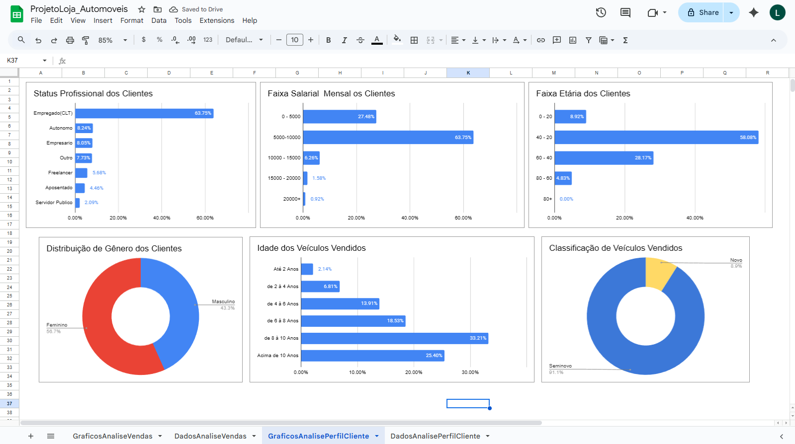

# Estudo de Caso: Análise de Vendas, Produtos e Perfil de Clientes de uma Franquia de Lojas de Automóveis

Este repositório apresenta um **estudo de caso de análise de dados de vendas e perfil de clientes** de uma franquia de lojas de automóveis.  
O objetivo é **identificar oportunidades estratégicas de investimento**, incluindo **estados com maior potencial de crescimento**, **produtos mais rentáveis** e **melhores dias e horários para veiculação de anúncios**, com base em dados históricos de vendas e comportamento dos clientes.

---

## 1. Objetivo

Identificar e lapidar a **persona dos clientes**, compreendendo de forma aprofundada **quais perfis, regiões e produtos apresentam melhor desempenho comercial**.

A análise se concentra nos seguintes pontos:

- **Faixa salarial e status profissional dos clientes**
- **Top 5 marcas mais vendidas no mês**, incluindo **faturamento total** e **ticket médio mensal**
- **Leads gerados e taxa de conversão**

Com base nos **padrões de vendas das lojas** e nos **dados comportamentais dos usuários**, o estudo busca gerar **insights estratégicos** para decisões de marketing, expansão e alocação de investimentos.

---

## 2. Dataset

O dataset foi obtido a partir de uma **fonte pública no Kaggle**, simulando dados reais do setor automotivo.

Principais conjuntos de dados:

- Dados de clientes (perfil socioeconômico e profissional)
- Dados de vendas (marca, valor, data, loja e estado)
- Dados de leads e conversões
- Dados de acesso e interação com campanhas digitais

**Formatos:** `.csv`

---

## 3. Métricas Analisadas

As principais métricas analisadas foram:

- `TotalVendas` — número total de vendas realizadas  
- `FaturamentoTotal` — soma do valor das vendas  
- `TicketMedio` — faturamento total dividido pelo número de vendas  
- `LeadsGerados` — total de leads captados  
- `TaxaConversao` — vendas realizadas / leads gerados  
- `VendasPorMarca` — desempenho por fabricante  
- `VendasPorEstado` — desempenho geográfico  

---

## 4. ETL com PostgreSQL

O processo de **ETL (Extract, Transform, Load)** foi realizado utilizando **PostgreSQL**, desde a ingestão dos arquivos `.csv` até a criação das tabelas analíticas finais.

### Etapas do ETL

- Importação dos dados brutos via `COPY`
- Padronização de datas e valores monetários (`CAST`, `TO_DATE`)
- Normalização de categorias (status profissional, faixas salariais, marcas)
- Criação de métricas derivadas:
  - `ticket_medio`
  - `taxa_conversao`
  - `faturamento_mensal`
- Junção entre tabelas de clientes, vendas e leads

### Exemplo de Query

```sql
WITH tabelarest AS (
    SELECT
        t1.product_id,
        t1.customer_id,
        (t2.price + (t2.price * t1.discount)) AS valor_real,
        EXTRACT(MONTH FROM paid_date) AS mes,
        EXTRACT(YEAR FROM paid_date) AS ano
    FROM sales.funnel AS t1
    LEFT JOIN sales.products AS t2
        ON t1.product_id = t2.product_id
    WHERE paid_date IS NOT NULL
    ORDER BY paid_date
)
SELECT
    ROUND(SUM(valor_real) / COUNT(DISTINCT customer_id), 2) AS ticket_medio,
    SUM(valor_real) AS faturamento,
    mes,
    ano
FROM tabelarest
GROUP BY
    ano,
    mes;

````
## 5. Principais Insights

Com base na análise dos dados de **vendas, leads e comportamento dos clientes**, foram identificados os seguintes padrões estratégicos para campanhas de marketing e veiculação de anúncios:

| Tipo de Campanha            | Melhor Dia           | Melhor Horário |
|-----------------------------|----------------------|----------------|
| Anúncios Promocionais       | Sexta e Sábado       | 18:00 – 21:00 |
| Conteúdo Institucional      | Segunda e Terça      | 16:00 – 19:00 |
| Campanhas de Conversão      | Domingo              | 17:00 – 20:00 |

### Observações

- **Sexta e sábado** concentram maior volume de acessos e interações, sendo ideais para **anúncios promocionais de curto impacto**.  
- **Segunda e terça-feira** apresentam melhor desempenho para **conteúdo institucional e informativo**, quando os usuários demonstram maior atenção.  
- **Domingo** registra a **maior taxa de conversão**, indicando um momento favorável para campanhas focadas em fechamento de vendas.  
- Os horários de maior engajamento geral ocorrem entre **16h e 21h**, tornando esse intervalo o mais eficiente para **veiculação de anúncios**.

---

## 6. Problemas Encontrados e Soluções

Durante o processo de **ETL e análise em PostgreSQL**, os seguintes problemas foram identificados:

1. **Inconsistência nos formatos de data e valores monetários**  
   - Solução: padronização utilizando funções do PostgreSQL como `TO_DATE`, `CAST` e `NUMERIC`.

2. **Duplicidade de registros após JOIN entre tabelas**  
   - Solução: deduplicação com uso de `ROW_NUMBER()` e filtros por chaves primárias.

3. **Registros com campos essenciais ausentes (ID ou Data)**  
   - Solução: exclusão desses registros, uma vez que não eram confiáveis para análises analíticas.

Essas ações garantiram a **qualidade, integridade e consistência dos dados**, possibilitando a geração de insights confiáveis para tomada de decisão.

---

## 7. Dashboard

Os resultados finais foram consolidados em um **dashboard analítico**, permitindo a visualização clara dos principais indicadores de desempenho, como:

- Faturamento por estado e marca  
- Ticket médio por perfil de cliente  
- Dias com maior acesso de Leads
- Gênero, Faixa Etária e Faixa Salarial dos clientes



